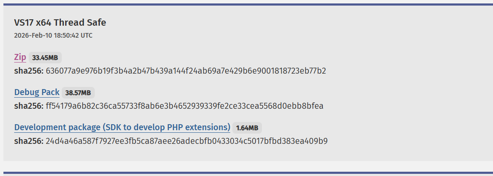
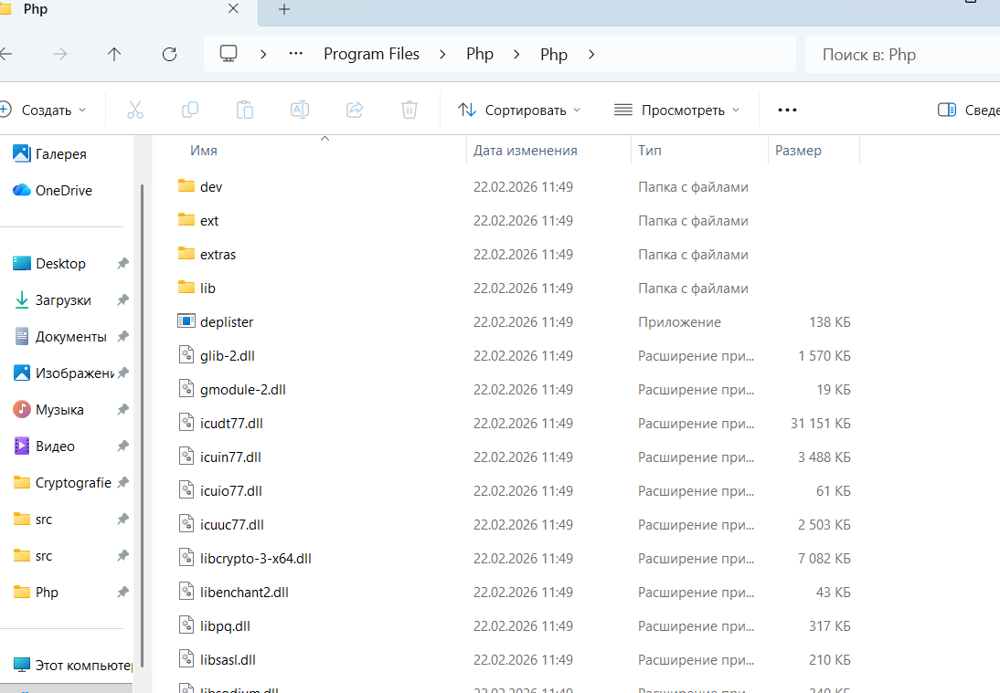
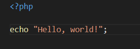
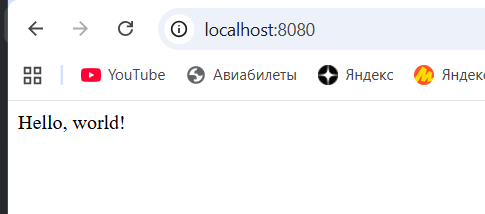
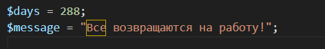
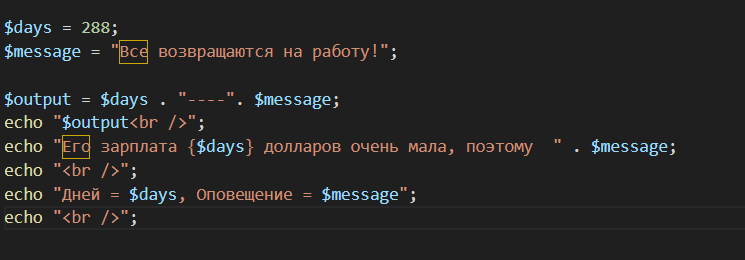
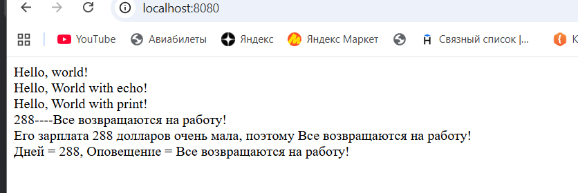

# Лабораторная работа №2. Установка и первая программа на PHP.
[**Ссылка на условие на GitHub**](https://github.com/MSU-Courses/advanced-web-development/tree/main/_lab/02_PHP_Introduction)

## Цель работы
Целью данной лабораторной работы является установка и настройка среды разработки для работы с языком программирования PHP, 
а также создание первой программы на PHP.

## Установка PHP
1. Перейдите на официальный сайт PHP: https://www.php.net/downloads.
2. Загрузите актуальную версию PHP для вашей операционной системы.

3. Распакуйте архив в удобное место, например: C:\Program Files\php.

4. Добавьте путь к PHP в переменные среды (Path):
* Откройте Параметры системы (Win + R → sysdm.cpl).
* Перейдите в Дополнительно → Переменные среды.
* В разделе Системные переменные выберите Path и добавьте путь C:\Program Files\php.
* Сохраните изменения.
5. Проверьте установку, выполнив в командной строке: php -v.
   (C:\Windows\System32>php -v
   PHP 8.5.3 (cli) (built: Feb 10 2026 18:44:09) (ZTS Visual C++ 2022 x64)
   Copyright (c) The PHP Group
   Built by The PHP Group
   Zend Engine v4.5.3, Copyright (c) Zend Technologies
   with Zend OPcache v8.5.3, Copyright (c), by Zend Technologies)

## Шаг 3. Написание первой PHP-программы
1. Создайте директорию для проекта, например: D:\Projects\PHP\01_Introduction.
--- C:\>cd C:\Users\user
C:\Users\user>cd Desktop
C:\Users\user\Desktop>mkdir PHPLabs
C:\Users\user\Desktop>cd PHPLabs
C:\Users\user\Desktop\PHPLabs>mkdir Lab1
C:\Users\user\Desktop\PHPLabs>cd Lab1
C:\Users\user\Desktop\PHPLabs\Lab1>echo index.php
index.php
C:\Users\user\Desktop\PHPLabs\Lab1>echo testinit >> index.php
---
2. Создайте файл index.php и откройте его в текстовом редакторе.

3. Вставьте следующий код (<?php
echo "Привет, мир!";):

4. Запустите программу с помощью встроенного веб-сервера PHP или с помощью XAMPP
   ---C:\Users\user\Desktop\PHPLabs\Lab1>php -S localhost:8080
   [Sun Feb 22 12:19:19 2026] PHP 8.5.3 Development Server (http://localhost:8080) started
   [Sun Feb 22 12:19:36 2026] [::1]:58626 Accepted
   [Sun Feb 22 12:19:36 2026] [::1]:51156 Accepted
   [Sun Feb 22 12:19:36 2026] [::1]:58626 [200]: GET /
   [Sun Feb 22 12:19:36 2026] [::1]:58626 Closing
   [Sun Feb 22 12:19:36 2026] [::1]:51156 [200]: GET /favicon.ico
   [Sun Feb 22 12:19:36 2026] [::1]:51156 Closing---

## Шаг 4. Вывод данных в PHP
1. Выведите строку "Hello, World!" используя функцию echo и print.

echo "Hello, World with echo!";
print "Hello, World with print!";

## Шаг 5. Работа с переменными и выводом
1. Создайте две переменные:
* Целочисленную переменную $days со значением 288.
* Строковую переменную $message с текстом: Все возвращаются на работу!.

2. Выведите значения переменных на экран несколькими способами:
* С использованием конкатенации. Конкатенация - это объединение строк, в PHP используется оператор .:
* С использованием двойных кавычек.

3. Используйте переход на новую строку в выводе используя тэг  .
